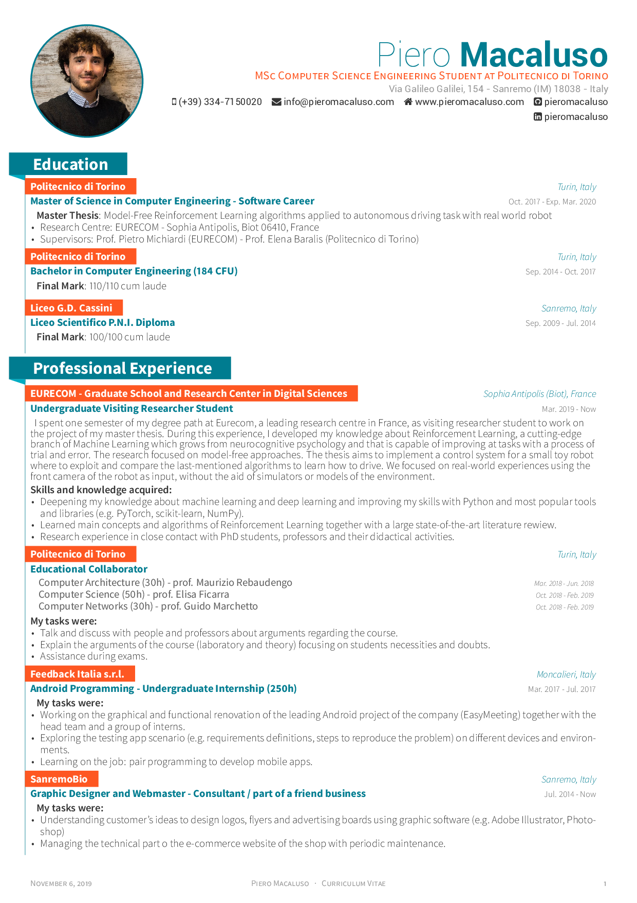
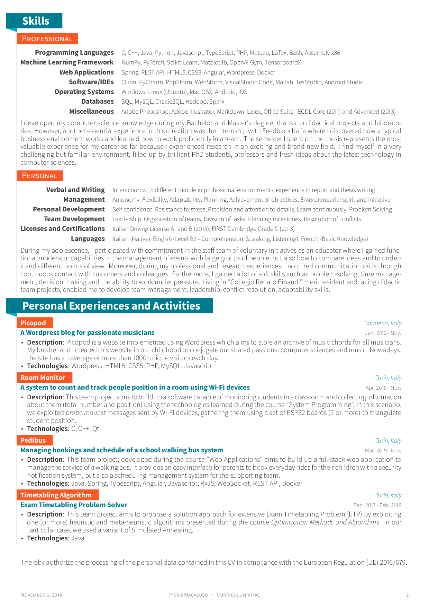
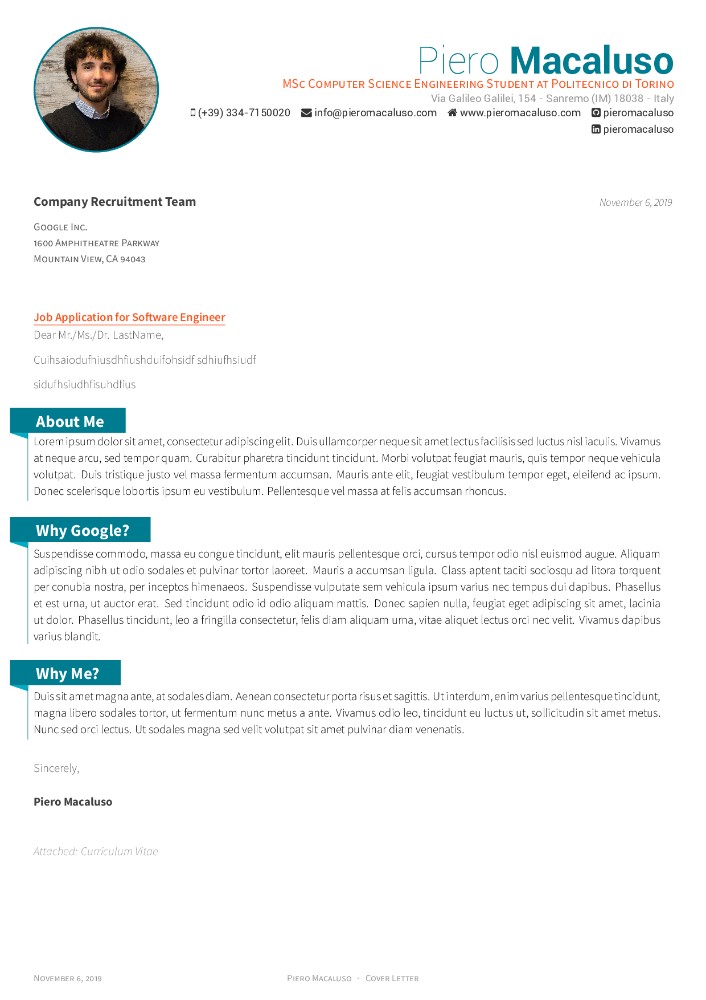
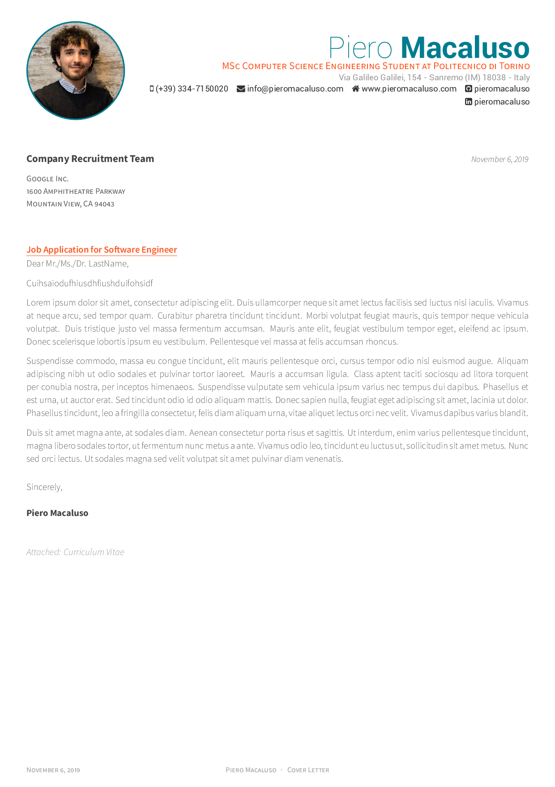

<h1 align="center">
  Dogear CV
</h1>

<p align="center">
  LaTeX template for your outstanding job application
</p>

<div align="center">
  <a href="https://circleci.com/gh/posquit0/Awesome-CV">
    
  </a>
  <a href="https://raw.githubusercontent.com/posquit0/Awesome-CV/master/examples/cv.pdf">
    
  </a>
  <a href="https://raw.githubusercontent.com/posquit0/Awesome-CV/master/examples/coverletter.pdf">
    
  </a>
</div>

<br />

## What is Awesome CV?

**Dogear CV** is LaTeX template for a **CV(Curriculum Vitae)**, **Résumé** or **Cover Letter** inspired by [Awesome CV](https://www.sharelatex.com/templates/cv-or-resume/fancy-cv). It is easy to customize your own template, especially since it is really written by a clean, semantic markup.

## Preview

#### Curriculum Vitae

You can see [PDF](examples/cv.pdf)

| Page. 1 | Page. 2 |
|:---:|:---:|
| [](examples/cv.pdf)  | [](examples/cv.pdf) |

#### Cover Letter

You can see [PDF](examples/coverletter.pdf)

| Without Sections | With Sections |
|:---:|:---:|
| [](examples/coverletter.pdf)  | [](examples/coverletter.pdf) |

## How to Use

#### Requirements

A full TeX distribution is assumed.  [Various distributions for different operating systems (Windows, Mac, \*nix) are available](http://tex.stackexchange.com/q/55437) but TeX Live is recommended.
You can [install TeX from upstream](http://tex.stackexchange.com/q/1092) (recommended; most up-to-date) or use `sudo apt-get install texlive-full` if you really want that.  (It's generally a few years behind.)

#### Usage

At a command prompt, run

```bash
$ xelatex {your-cv}.tex
```

This should result in the creation of ``{your-cv}.pdf``


## Credit

[**LaTeX**](http://www.latex-project.org) is a fantastic typesetting program that a lot of people use these days, especially the math and computer science people in academia.

[**LaTeX FontAwesome**](https://github.com/furl/latex-fontawesome) is bindings for FontAwesome icons to be used in XeLaTeX.

[**Roboto**](https://github.com/google/roboto) is the default font on Android and ChromeOS, and the recommended font for Google’s visual language, Material Design.

[**Source Sans Pro**](https://github.com/adobe-fonts/source-sans-pro) is a set of OpenType fonts that have been designed to work well in user interface (UI) environments.


## Contact

You are free to take my `.tex` file and modify it to create your own resume. Please don't use my resume for anything else without my permission, though!

If you have any questions, feel free to join me at [`@PieroMacaluso` on Telegram](https://t.me/PieroMacaluso) and ask away.

Good luck!
